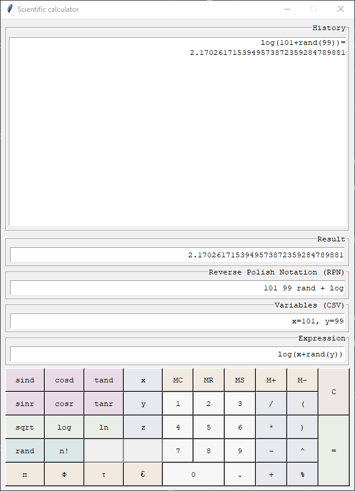

# Tieteellinen laskin

 

- [Vaatimusmäärittely](documentation/vaatimusmäärittely.md)
- [Testausdokumentti](documentation/testausdokumentti.md)

## Viikkoraportit

- [1. Viikkoraportti](documentation/viikkoraportti_1.md)
- [2. Viikkoraportti](documentation/viikkoraportti_2.md)
- [3. Viikkoraportti](documentation/viikkoraportti_3.md)
- [4. Viikkoraportti](documentation/viikkoraportti_4.md)

## Pikaohje

Ohjelmisto on toteutettu ja testattu [Python](https://www.python.org/)-versiolla `3.10` sekä riippuvuuksien hallintaan käytettävällä [Poetry](https://python-poetry.org/)-versiolla `1.3`. Vanhemmilla versioilla ohjelmiston toiminnassa saattaa esiintyä ongelmia. 

### Asentaminen ja käyttäminen

- [Ohjeet Pythonin asentamiseksi](https://www.python.org/downloads/).
- [Ohjeet Poetryn asentamiseksi](https://python-poetry.org/docs/).
- Lataa tämä repositorio koneellesi ja pura se haluamaasi paikkaan.
- Navigoi komentoriviä käyttäen purkamasi kansion juureen.
- Asenna projektin käyttämät riippuvuudet komennolla: `poetry install`.
- Siirry virtuaaliympäristöön komennolla: `poetry shell`.
- Käynnistä projekti komennolla: `invoke start `.
- Poistu virtuaaliympäristöstä komennolla `exit`.
