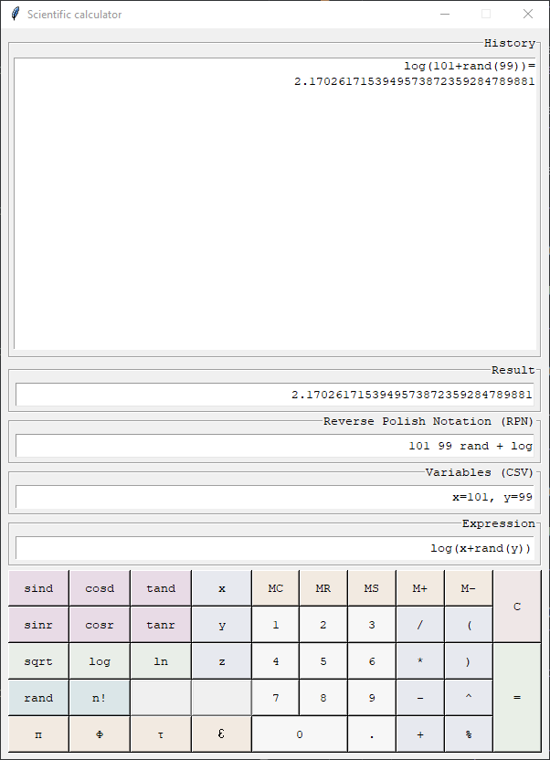

# Käyttöohje

## Asennusohje

Ohjelmisto on toteutettu ja testattu [Python](https://www.python.org/)-versiolla `3.10` sen Tkinter-kirjastolla sekä riippuvuuksien hallintaan käytettävällä [Poetry](https://python-poetry.org/)-versiolla `1.3`. Vanhemmilla versioilla ohjelmiston toiminnassa saattaa esiintyä ongelmia. 

- [Ohjeet Pythonin asentamiseksi](https://www.python.org/downloads/).
- [Ohjeet Poetryn asentamiseksi](https://python-poetry.org/docs/).
- Lataa tämä repositorio koneellesi ja pura se haluamaasi paikkaan.
- Navigoi komentoriviä käyttäen purkamasi kansion juureen.
- Asenna projektin käyttämät riippuvuudet komennolla: `poetry install`.

## Tieteellisen laskimen käyttäminen

### Käynnistäminen

- Siirry virtuaaliympäristöön komennolla: `poetry shell`.
- Käynnistä laskin komennolla: `invoke start`.

### Perustoiminnot

Laskimen toiminta perustuu joko ruudulla olevien näppäinten käyttöön, tai kirjoittamalla laskutoimituksen suoraan `Expression` -kenttään. Kyseinen kenttä tukee myös laskutoimitusten liittämistä (`ctrl + v`).

Laskimen peruslaskutoiminnot ovat itsestäänselvät jokaiselle nelilaskinta joskus käyttäneelle, mutta näiden toimintojen lisäksi laskimessa on mahdollista käyttää myös muuttujia sekä funktioita.

### Muuttujat

Laskin tukee `Variables` -kenttään syötettyjä muuttujia, kuten esimerkiksi `x=1` tai `kissa=3.8`. Muuttujia voi käyttä todella vapaasti, eikä niiden lukumäärää ole rajoitettu. Muuttujien joukossa eri muuttujat eroitetaan toisistaan pilkulla, kuten esimerkiksi: `x=11,y=22,z=33` tai `kissa=8, koira=4, kani=6`. Edellä mainittuja muuttujia voisi käyttää `Expression` -kenttään kirjoitetussa laskukaavassa esimerkiksi: `(x*y)/(x^z)`

### Funktiot

Laskin tukee `Expression` -kenttään syötettyjä funktioita muodossa `sin()`, `cos()` ja `tan()`. Funktioihin voi sisällyttää yhtälöitä sekä muuttujia, esimerkiksi: `sin(x*4.2)`.

### Laskimen sulkeminen

- Laskin suljetaan otsikkopalkissa olevasta ruksista.
- Komentorivillä auki olevasta Poetryn virtuaaliympäristöstä voi poistua komennolla `exit`.

## Mahdolliset ongelmatilanteet

Testauksessa on ilmennyt joidenkin Linux jakelujen sisältämä puuttellinen asennus Python 3:sta, joka ei jostain syystä sisällä kirjastoa `tkinter`. Jos projekti ei käynnisty `invoke start` komennolla, asenna kirjasto tkinter Poetry-virtuaaliympäristön ulkopuolella komennolla `sudo apt install python3-tk`.