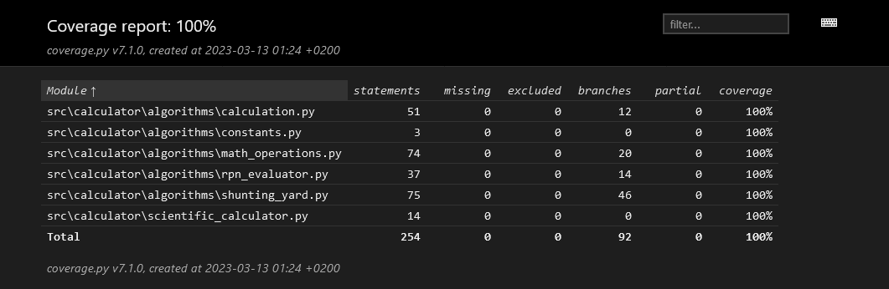

# Testausdokumentti

Ohjelmaa testataan automaattisesti jokaisen GitHub -versionhallintaan suoritettavan tallennuksen yhteydessä hyödyntäen GitHub Actions -alustaa. Testaus on tällä hetkellä käytännössä Pytest -yksikkötestit ja siitä Coveragella luotujen raporttien lataaminen Codecov -palveluun.

Paikallisesti kehityksen aikaisessa testauksessa suoritetaan Pytest -yksikkötestejä, tämän lisäksi Pylint sekä Autopep8 suorittavat koodin laadunvalvontaa littyviä toimia sekä raportointia.

## Yksikkötestit ja testikattavuus

Pytest -yksikkötestejä on laajennettu koskemaan jokaista ohjelman kannalta oleellista funktiota sekä metodia.
Yksikkötestejä on tällä hetkellä 155 kappaletta ja ne testaavat oikeita sekä virheellisiä syötteitä. Niillä pyritään 
tuottamaan oikeita tuloksia sekä virheilmoituksia. Testeissä mukana olevien laskujen tuloksia on validoitu GeoGebralla,
Wolfram Alphalla sekä erinäisten käyttöjärjestelmien mukana tulleilla tieteellisillä laskimilla.

- Yksikkötestit löytyvät projektin kansiosta `src/tests`.
- Yksikkötestit voi toistaa Poetryn virtuaaliympäristössä* komennolla: `invoke test`. 
- Raportin testauksesta ja haaraumakattuvudesta voi tuottaa Poetryn virtuaaliympäristössä* komennolla: `invoke coverage`.
- Raportin voi avata joko suoraan sovelluksen projektikansiosta `htmlcov/index.html`, tai suorittamalla Poetryn virtuaaliympäristössä* komennon: `invoke report`.

Coveragen luoman raportin mukaan haarautumakattavuus on tällä hetkellä `100%`.

Ajankohtainen testikattavuusraportti löytyy myös osoitteesta: https://app.codecov.io/gh/TeemuBergman/tiralabra23

## Pylint

Pylintillä suoritettujen testien arvosana on tällä hetkellä `10/10`. 
Koodia on muokattu Pylintin antamien ilmoitusten mukaisesti ja muun muassa jokaiselle funktiolle on pyritty lisäämään
sen toimintaa selittävä docstring sekä kommentit, pitämään rivien pituudet alle sadassa merkissä sekä siivoamaan 
käyttämättömät funktiot ja muuttujat pois.

Pylintin voin suorittaa Poetry shellistä* komennolla `invoke linter`.

*Poetry shell käynnistetään komentoriviltä komennolla `poetry shell`.