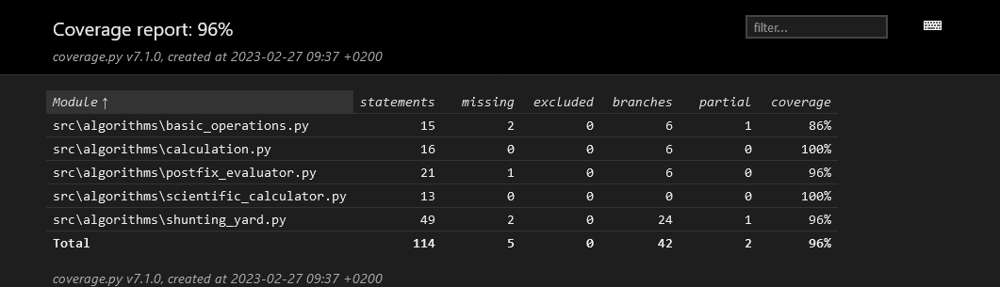

# Testausdokumentti

Ohjelmaa testataan automaattisesti jokaisen GitHub -versionhallintaan suoritettavan tallennuksen yhteydessä hyödyntäen GitHub Actions -alustaa. Testaus on tällä hetkellä käytännössä Pytest -yksikkötestit ja siitä Coveragella luotujen raporttien lataaminen Codecov -palveluun.

Paikallisesti kehityksen aikaisessa testauksessa suoritetaan Pytest -yksikkötestejä, tämän lisäksi Pylint sekä Autopep8 suorittavat koodin laadunvalvontaa littyviä toimia sekä raportointia.

## Testikattavuus

Pytest -yksikkötestejä on laajennettu koskemaan jokaista ohjelman kannalta oleellista funktiota. Coveragen luoman raportin mukaan haarautumakattavuus on tällä hetkellä `96%`.

Ajankohtainen testikattavuusraportti löytyy osoitteesta: https://app.codecov.io/gh/TeemuBergman/tiralabra23

## Pylint

Pylintillä suoritettujen testien arvosana on tällä hetkellä `9.17/10`. Koodia on muokattu Pylintin antamien ilmoitusten mukaisesti ja muun muassa jokaiselle funktiolle on pyritty lisäämään sen toimintaa selittävä docstring sekä kommentit.