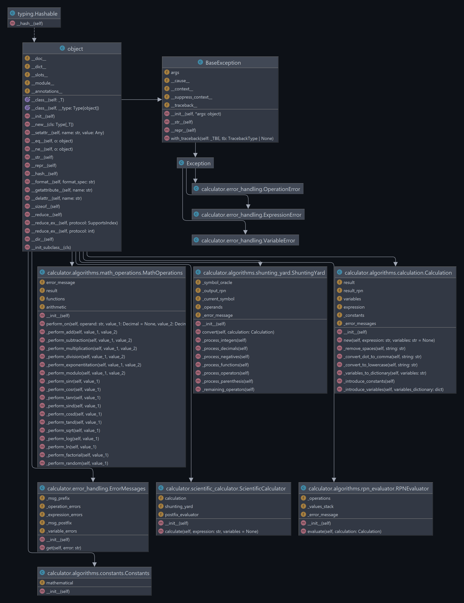

# Toteutusdokumentti

## Sovelluksen yleisrakenne

Tieteellinen laskin -sovelluksen lähdekoodi löytyy `src` -kansiosta, sen keskeiseen toimintaan liittyvät algoritmit löytyvät kansiosta: `calculator/algorithms`, yksikkötestit kansiosta: `tests` sekä graafinen käyttöliittymä kansiosta: `gui`.

### Sovelluksen luokat

- `ScientificCalculator`
  - Sovelluksen toimintoja yhteen sitova pääluokka, jonka kautta laskinta on mahdollista yksinkertaisimmillaan käyttää.
- `Calculation`
  - Suorituksen aikaisen tiedon muokkaamiseen, kuten matemaattisten vakioiden sekä käyttäjän muuttujien lisääminen syötettyyn laskutoimitukseen ja sen eri vaiheissa muodostuneiden tulosten tallentamiseen.
- `Constants`
  - Tämä luokka sisältää laskennassa käytettäviä matemaattisia vakioita kuten: Pi, Phi, Tau ja Eulerin numeron.
- `ShuntingYard`
  - Sovelluksen yksi pääalgoritmeistä, joka toteuttaa syötetyn laskutoimituksen muuttamisen`Reverse Polish notation (RPN)` -muotoon.
- `RPNEvaluator`
  - Sovelluksen toinen pääalgoritmi, joka `MathOperations` -luokan kanssa laskee sille syötetystä, RPN muotoisesta lausekkeesta sen tuloksen.
- `MathOperations`
  - Yksittäisten laskutoimitusten (peruslaskutoimitukset sekä funktiot) suorittaminen ja niiden tulosten palauttaminen `RPNEvaluator` -luokkaan.
- `ErrorHandling`
  - Sovelluksen virheidenhallinta sisältäen kaikki käyttäjälle näytettävät virheviestit.
  

## Aikavaativuus

Sovelluksen keskeisimpien toimintojen aikavaativuus on `O(n^2)`. Laskimeen ei normaalissa käytössä syötetä merkkimäärältään kovinkaan suuria syötteitä, joten tämä aikavaativuus on vielä hyväksyttävissä rajoissa. Alkuperäisen `Shunting Yard` sekä `RPN Evaluator` -algoritmien aikavaativuudet ovat `0(n)` ja pääsin omassa 
toteutuksessani tähän samaan suorityskykyyn.

### Shunting Yard

`Shunting Yard` -algoritmi on matemaattisten lausekkeiden uudelleen jäsentämisessä käytetty algoritmi, joka muuntaa syötteen sisältämän infix-lausekkeen Reverse Polish notation (RPN)/postfix -muotoon [Dijkstra, 1961] [Reverse Polish notation, n.d.]. Toiminnassaan se käyttää kahta pinoa, joista suorituksen aikana toiseen siirretään operaattorit ja toiseen operandit.

Suorituksen aikana `Shunting Yard` -algoritmi käy syötteen läpi merkki kerrallaan ja lisää jokaisen operandin suoraan output-pinoon sekä operaattorit niiden omaan operators-pinoon. 

Operaattoreita käsitellessään algoritmi tarkastelee niitä laskujärjestyksen perusteella ja vertaa, tarvitseeko operaattori lisätä niiden omaan pinoon vai lisätäänkö se output-pinoon. 

Sulut käsitellään siten, että niistä vasemmanpuoleinen lisätään suoraan operaattorien kanssa samaan pinoon ja kun syötteessä tulee vastaan oikeanpuoleinen sulku, operaattoripinosta lisätään operaattori kerrallaan output pinoon,  kunnes vastan tulee vasemmanpuoleinen sulku ja täten algoritmi palaa takaisin sen päätoistolauseeseen. 

Kun algoritmi on käynyt koko syötteen läpi, on output-pinossa lopputuloksena sen RPN-muotoinen lauseke.

Shunting Yard -algoritmin ei sisällä kovinkaan monimutkaisia rakenteita, jotka vaatisivat esimerkiksi sisäkkäisiä toistolausekkeita, joten sen aikavaativuus on lineaarinen `O(n)` suhteessa syötteen pituuteen.

### RPN Evaluator (Postfix expression stack evaluator)

`RPN Evaluator` -algoritmi arvioi RPN/postfix-muotoisen lausekkeen arvon käyttämällä pinoa ja suorittamalla tarvittavat laskutoimitukset [Stack-oriented programming, n.d.]. Koska algoritmi käy läpi syötteen vain kerran ja suorittaa jokaisen laskutoimituksen vain kerran, sen aikavaativuus on lineaarinen suhteessa syötteen pituuteen.

`RPN Evaluator` -algoritmi käy läpi syötteen merkki kerrallaan, jolloin se tallentaa yhteen pinoon kaikki operandit, kunnes se kohtaa operaattorin. Tällöin se operaattorista riippuen poistaa yksi tai kaksi pinon viimeistä arvoa, joiden avulla se suorittaa tarvittavan laskutoimituksen ja lisää siitä saadun tuloksen edellä mainitun pinon päälle. 

Kun se on käynyt läpi syötteen kaikki merkit, pinossa on jäljellä enää vain yksi arvo, joka on lausekkeen lopullinen arvo.

`RPN Evaluator` -algoritmi on rakenteeltaan myös hyvin suoraviivainen, joten sen aikavaativuus on myös `O(n)` suhteessa syötteen pituuteen.

### Calculation

Algoritmin suurimman aikavaativuuden `O(n^2)` asettaa `Calculation` luokassa olevat funktiot `introduce_constants` sekä `introduce_variables` jotka korvaavat lausekkeessa olevat vakioiden ja muuttujien merkinnät niitä vastaavilla arvoilla. Nämä vakiot ja muuttujat ovat merkkimäärältään kuitenkin niin pieniä, että käytännössä nämä operaatiot tapahtuvat millisekunneissa.

## Tilavaativuus

Sovelluksen tietorakenteina käytetään yksittäisiä muuttujia, pinoja sekä sanakirjoja. Suorituksen aikana keskusmuistiin tallennettavan tiedon määrä liikkuu muutamissa kymmenissä tai sadoissa kilotavuissa.

## Puutteet ja parannusehdotukset

- Laskimeen voisi lisätä ainakin uusia funktioita. Tämä onneksi on oman `MathOperations` -luokan ansiosta vaivatonta.
- Käyttöliittymää voisi jälleen muokata käytettävämpään suuntaan, lähinnä painikkeiden ja historianäkymän osalta. Tämä tieteellinen laskin oli siis ensimmäinen projekti jossa käytin Tkinteriä ja sen päälle rakennettua visuaalista suunnittelytyökalua Pygubu-designeria, joten osa sen ominaisuuksista ja rajoitteista selvisi vasta tämän projektin aikana.

## Lähteet

- Dijkstra, E. W., (1961), Making a Translator for ALGOL-60. ALGOL Bulletin Supplement nr. 10, November 1961, s. 1 -11. Haettu 12.3.2023 osoitteesta: //[www.cs.utexas.edu/~EWD/MCReps/MR35.PDF](www.cs.utexas.edu/~EWD/MCReps/MR35.PDF)

- Reverse Polish notation. (n.d.). Wikipedia. Haettu 12.3.2023 osoitteesta: //[en.wikipedia.org/wiki/Reverse_Polish_notation](https://en.wikipedia.org/wiki/Reverse_Polish_notation)
- Stack-oriented programming. (n.d.). Wikipedia. Haettu 12.3.2023 osoitteesta: //[en.wikipedia.org/wiki/Stack-oriented_programming](https://en.wikipedia.org/wiki/Stack-oriented_programming)
